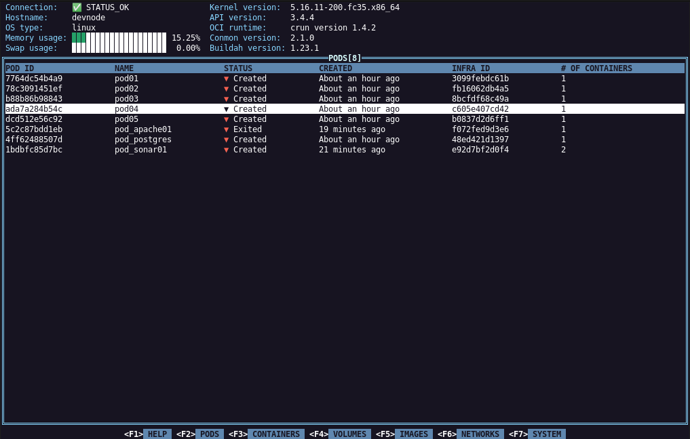

## podman-tui


[](https://goreportcard.com/report/github.com/containers/podman-tui)
[](https://codecov.io/gh/navidys/podman-tui)

Terminal user interface for Podman environment.



- [**Overview**](#overview)
- [**Compatibility Matrix**](#compatibility-matrix)
- [**Installation**](#installation)
- [**PreRun Checks**](#prerun-checks)
- [**Key Bindings**](#key-bindings)
- [**Code of Conduct**](#code-of-conduct)
- [**License**](#license)

## Overview

podman-tui is a terminal user interface for podman environment.
It is using [podman go bindings](https://github.com/containers/podman/tree/main/pkg/bindings) to communicate with local or remote podman machine (through SSH).

## Compatibility matrix

| Terminal User Interface  | Podman |
| ----------- | ------ |
| releaes-1.x | v5.x.y |
| release-0.x | v4.x.y |

## Installation

Building from source (Linux, Windows and MacOS) or installing packaged versions are detailed in [install guide](install.md).

## PreRun Checks

* `podman.socket` service needs to be running on podman machine.
    The recommended way to start Podman system service in production mode is via systemd socket-activation:

    ```shell
    $ systemctl --user start podman.socket
    ```

    See [start podman system service](https://podman.io/blogs/2020/08/10/podman-go-bindings.html) for more details.

* If the SSH key has a passphrase, then you need to set and export `CONTAINER_PASSPHRASE=<password>` variable.
    ```shell
    $ export CONTAINER_PASSPHRASE=keypass
    ```

* podman-tui uses 256 colors terminal mode on `Nix` system and standard ANSI colors on `Windows` system (use "command prompt" application).


## Key Bindings

Check [podman-tui docs](./docs/README.md) for keyboard mappings.

## Code of Conduct

This project is using the [Containers Community Code of Conduct](https://github.com/containers/common/blob/main/CODE-OF-CONDUCT.md)

## License

Licensed under the [Apache 2.0](LICENSE) license.
