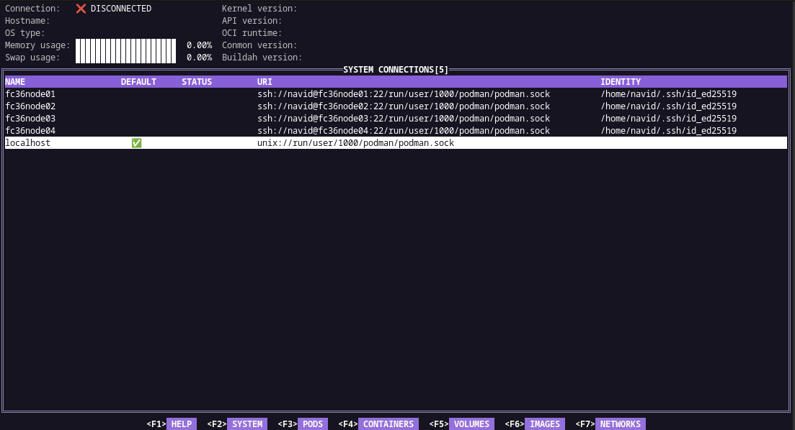

## podman-tui


[](https://pkg.go.dev/github.com/containers/podman-tui)
[](https://goreportcard.com/report/github.com/containers/podman-tui)

podman-tui is a Terminal User Interface to interact with the podman (v3.x).  
[podman bindings](https://github.com/containers/podman/tree/main/pkg/bindings) has been used to communicate with podman environment through rest api API (unix socket).



---

## Building From Source

podman-tui is using go version >= 1.17. 
 1. Clone the repo
 2. Build

      ```shell
      $ make binary
      ```
 3. Run podman-tui

      ```shell
      $ ./bin/podman-tui
      ```

Run `sudo make install` if you want to install the binary on the node.

---

## PreRun Checks

* podman-tui use podman unix socket for query therefore `podman.socket` service needs to be running.  
    The recommended way to start Podman system service in production mode is via systemd socket-activation:  

    ```shell
    $ systemctl --user start podman.socket
    ```

    See [start podman system service](https://podman.io/blogs/2020/08/10/podman-go-bindings.html) for more details.

* podman-tui uses 256 colors terminal mode. On `Nix system make sure TERM is set accordingly.

    ```shell
    $ export TERM=xterm-256color
    ```

---

## The Command Line
```shell
Usage:
  podman-tui [flags]
  podman-tui [command]

Available Commands:
  help        Help about any command
  version     Display podman-tui version and exit.


Flags:
  -d, --debug             Run application in debug mode
  -h, --help              help for podman-tui
  -l, --log-file string   Application runtime log file (default "podman-tui.log")

```

---

## Key Binding

podman-tui uses following keyboard keys for different actions:

| Action                           | Command |
| -------------------------------- | ------- |
| To view pods list page           | F1      |
| To view containers list page     | F2      |
| To view volumes list page        | F3      |
| To view images list page         | F4      |
| To view networks list page       | F5      |
| To view system page              | F6      |
| Lunch page command dialog        | Enter   |
| Close a dialog                   | Esc     |
| Switch between interface widgets | Tab     |


---

## Available commands on different views

Check [podman-tui docs](./docs/README.md) for list of available commands on different pages (pods, containers, images, ...)

