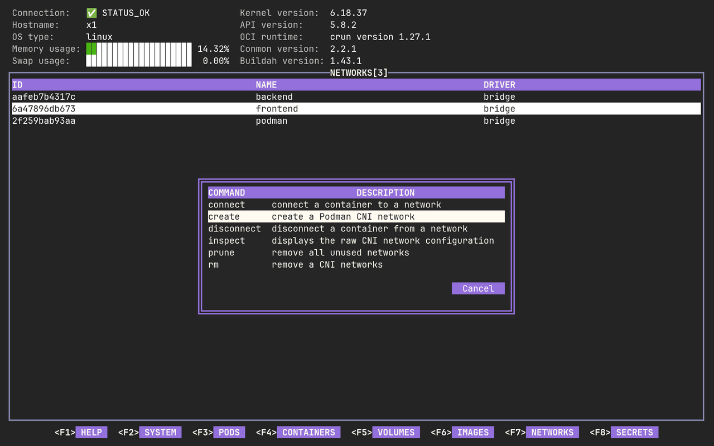
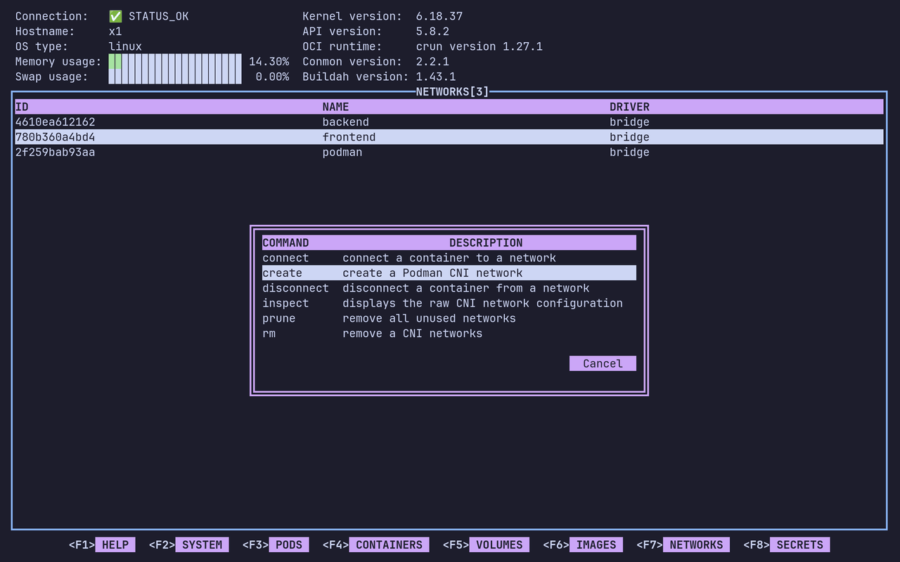
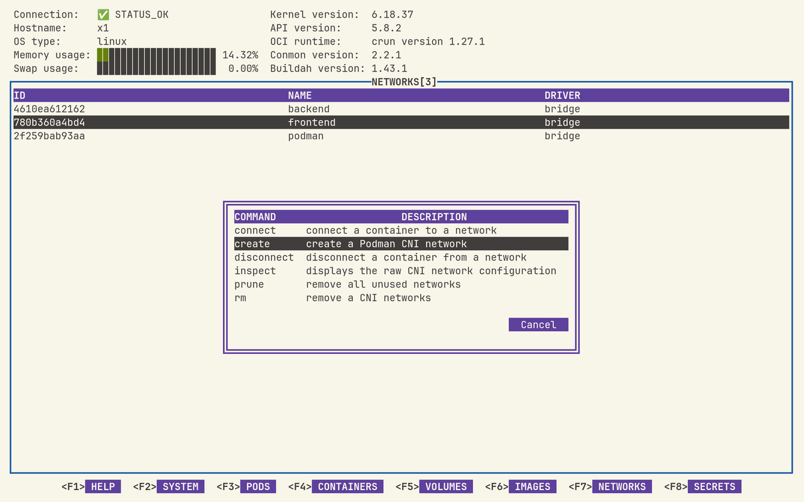
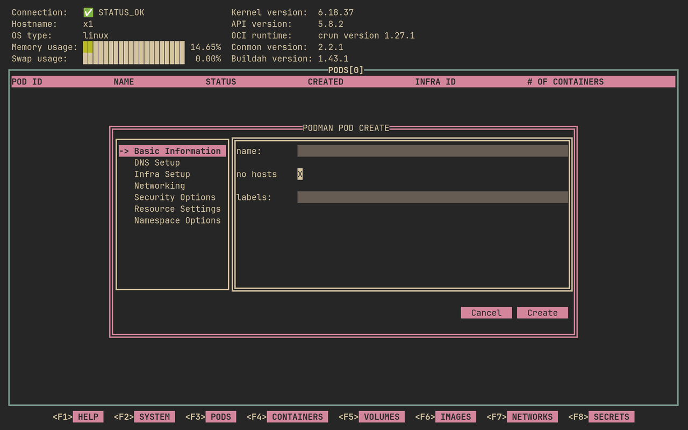
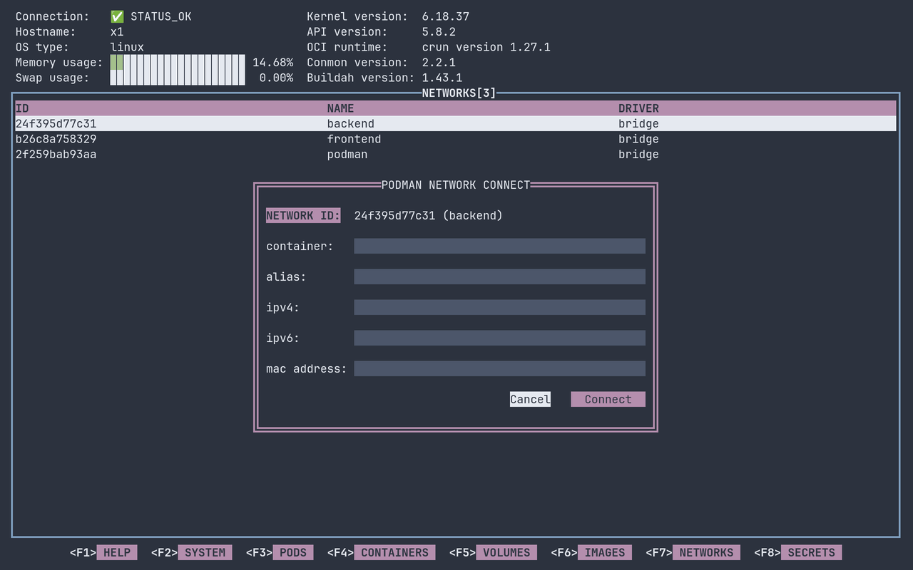
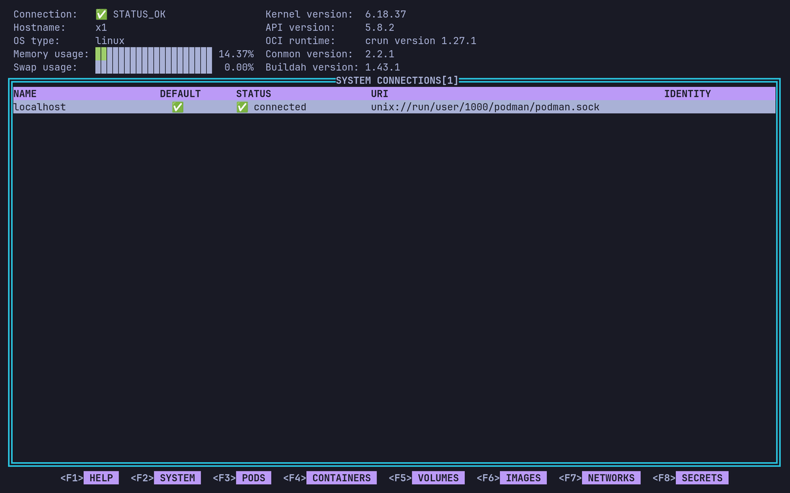
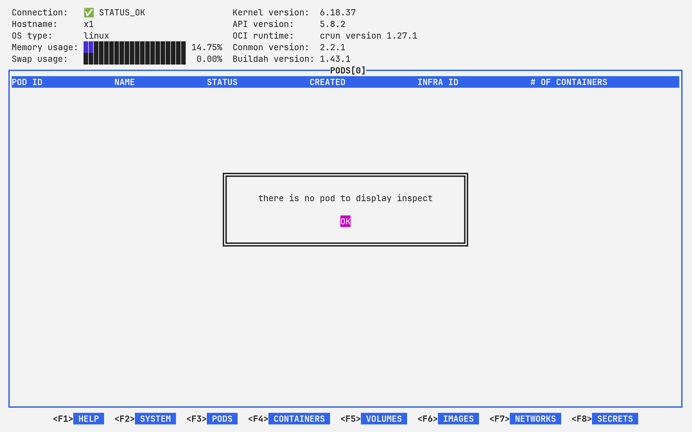
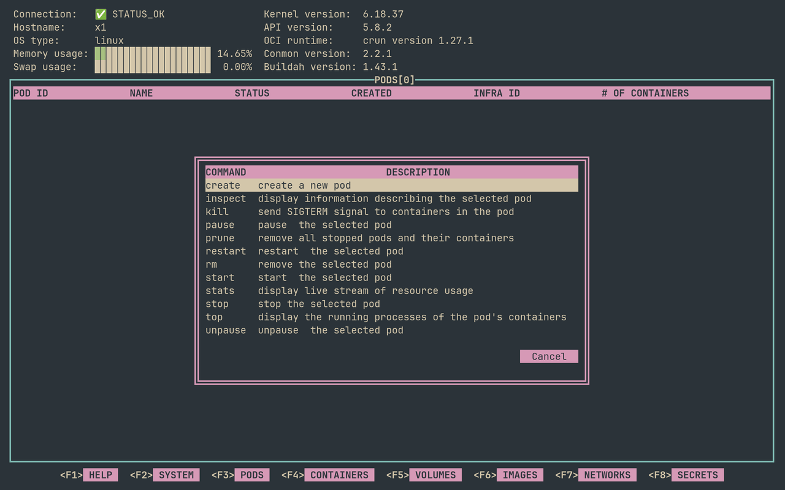
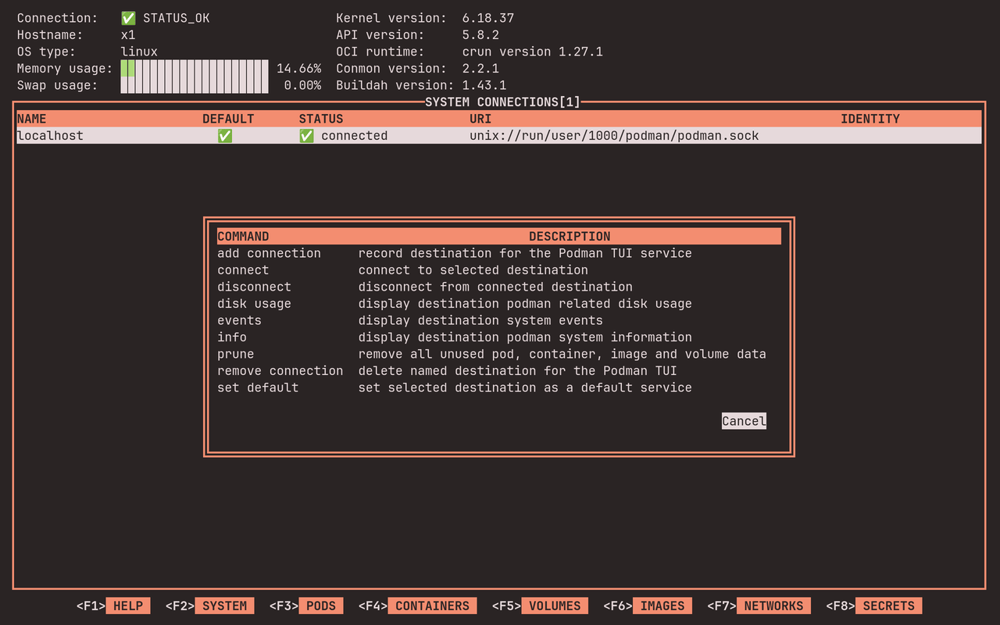
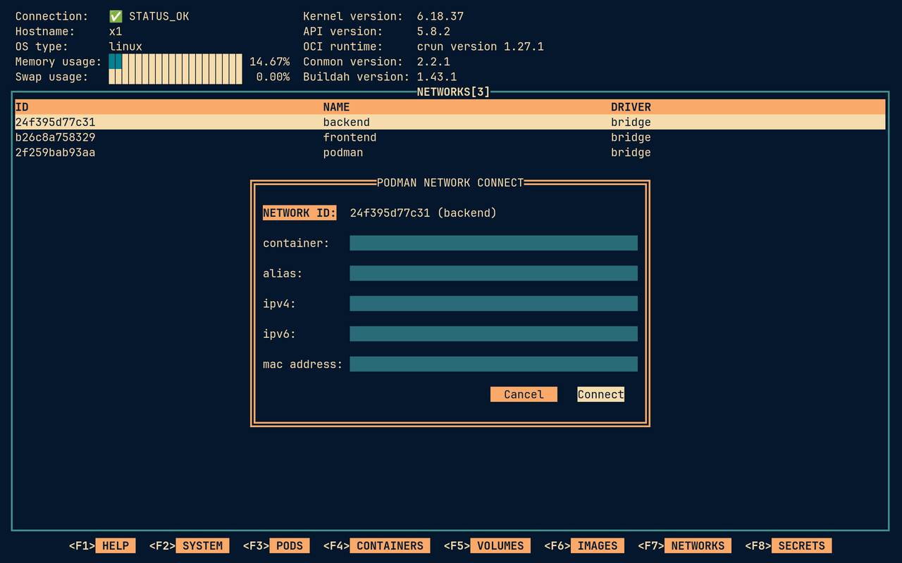

## Color Themes

podman-tui comes with two color themes:

- **default** uses podman-tui's own colors. This is what you get unless you
  choose another theme.
- **terminal** uses your terminal's colors instead, so podman-tui matches the
  rest of your terminal, whether you use a light or a dark color scheme.

## Choosing a Theme

Start podman-tui with the `--theme` option:

```shell
$ podman-tui --theme terminal
```

Or set the `PODMAN_TUI_THEME` environment variable, for example in your shell
profile:

```shell
$ export PODMAN_TUI_THEME=terminal
```

If both are set, the `--theme` option wins. If podman-tui doesn't know the
theme name, it exits with an error that lists the available themes.

## The Default Theme

This is podman-tui's original look. It is made for dark color schemes.



## The Terminal Theme

The terminal theme only uses your terminal's foreground and background colors
and its 16 basic colors. Change your terminal's color scheme while podman-tui
is running, and podman-tui changes with it.

The selected row and the focused button, checkbox or dropdown use reversed
colors (your terminal's text and background colors swapped), so you can always
see where you are. The OK button of an error message uses your terminal's red
instead.

Headers, buttons, the F-key bar and a few labels use your terminal's magenta.
Some color schemes put a different color there, such as blue in Lupine.

Here is how it looks with some popular color schemes. The screenshots were
taken in the [foot](https://codeberg.org/dnkl/foot) terminal.

**Catppuccin**: the networks screen with the command menu open.



**Flexoki Light** (a light scheme): the same screen.



**Gruvbox**: creating a pod, with the "no hosts" checkbox focused.



**Nord**: connecting a network, with the Cancel button focused.



**Tokyo Night**: the system screen.



**Lupine** (a light scheme): an error message.



**Everforest**: the pods screen with the command menu open.



**Ristretto**: the system screen's command menu, with the Cancel button
focused.



**Retro 82**: connecting a network, with the Connect button focused.


