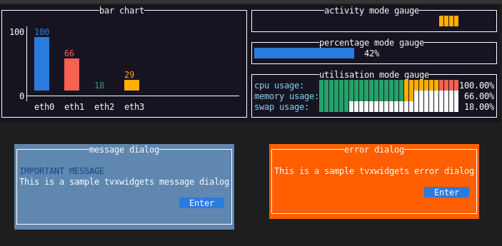

# tvxwidgets


[](https://pkg.go.dev/github.com/navidys/tvxwidgets)
[](https://goreportcard.com/report/github.com/navidys/tvxwidgets)

tvxwidgets provides extra widgets for [tview](https://github.com/rivo/tview).  
`NOTE:` The project is at its early stages and under development, feel free to contribute and report bugs.



## Example

```go
package main

import (
	"time"

	"github.com/gdamore/tcell/v2"
	"github.com/navidys/tvxwidgets"
	"github.com/rivo/tview"
)

func main() {
	app := tview.NewApplication()
	gauge := tvxwidgets.NewActivityModeGauge()
	gauge.SetTitle("activity mode gauge")
	gauge.SetPgBgColor(tcell.ColorOrange)
	gauge.SetRect(10, 4, 50, 3)
	gauge.SetBorder(true)

	update := func() {
		tick := time.NewTicker(500 * time.Millisecond)
		for {
			select {
			case <-tick.C:
				gauge.Pulse()
				app.Draw()
			}
		}
	}
	go update()

	if err := app.SetRoot(gauge, false).EnableMouse(true).Run(); err != nil {
		panic(err)
	}
}

```

## Widgets

* bar chart
* activity mode gauge
* percentage mode gauge
* utilisation mode gauge
* message dialog (info and error)

under development:

* context menu
* stack view
* ...